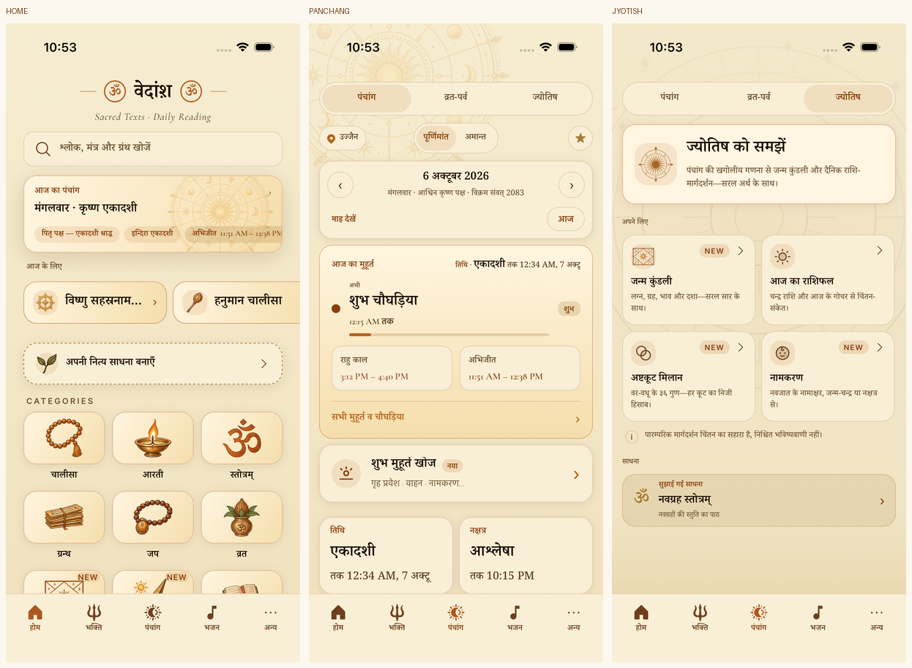

# Three native celestial chakra placements

The user selected all three concepts because they occupy different screens. The installed React Native app now uses a cropped upper-left wheel in calendar-mode Panchang, a wheel inside Home’s Today card, and a smaller seal in the guest Jyotish introduction. The actual Kundali tool retains its existing house-chart icon. Vrat & Parv and Jyotish retain their existing geometric background.

## Assets and integration

`mobile/src/components/CelestialChakra.tsx` owns two static, transparent local PNGs. The detailed wheel is reused rather than duplicated. Home places it at 160dp, right 4 / top −32, opacity 0.32; its own rounded clipping layer preserves the card shadow. Calendar mode places the same art at 360dp, left −70 / top −110, opacity 0.18 over the app’s parchment gradient. The centered 54dp seal sits inside the existing 58dp intro tile. All decorations preserve square aspect ratio and are non-interactive and hidden from accessibility. No calculation, route, label, chip behavior or saved-profile layout is replaced.

The art was generated using the built-in `image_gen` tool from the supplied reference and selected screens, then packaged as indexed-alpha PNGs. Exact prompts, generation/edit history, reference/master hashes, original intermediate metadata and final shipped hashes are in [wheel provenance](../../../mobile/assets/decorations/celestial-chakra/wheel-provenance.json), [seal provenance](../../../mobile/assets/decorations/celestial-chakra/seal-provenance.json) and the [final manifest](../../../mobile/assets/decorations/celestial-chakra/manifest.json). Generated masters remain at the recorded local paths; only the final two PNGs ship. Packaging retains their artwork and alpha without runtime tint. `source-reference.png` and `targets/` preserve the supplied photo and the three selected mockups.

## Evidence and comparison

The native captures are from the final installed iOS Release, 1.4.9 (69), iOS 26.5, on the dedicated 402×874pt simulator at 3x (1206×2622px). Hindi uses default system text (`large`); English additionally uses `accessibility-medium`. Both were restored to Hindi/default afterward. `capture-metadata.json` records device, source density and installed bundle hash.

- [Home source/native](home-comparison.png), [Panchang source/native](panchang-comparison.png), [Jyotish source/native](jyotish-comparison.png), and [focused comparison](focused-comparison.png) combine the actual source and rendered result at the same logical density.
- [Enlarged English](enlarged-english-preview.png) checks containment and copy reflow; `native/` retains every full-resolution capture.
- `before/` contains the original installed screens, and `iterations/` retains the first Home comparison that showed insufficient ornament visibility.
- The native status bar is intentionally preserved; generated mockups omit its clock/network glyphs. Live time changed from the mock’s early-evening avoid window to the night’s auspicious Choghadiya, changing that card’s copy/height. This comes from the existing engine, not the decorative asset.

The first Home render used 0.22 opacity and was too pale against the existing gradient. Raising it to 0.32 resolved that finding; fresh final screenshots and the focused combined comparison were inspected. The illustrations are reconstructions, with small differences in stars, rays and grain; the seal keeps extra edge clearance inside its tile. Fonts, tokens, existing card geometry, native chrome and live content remain app-owned.

At enlarged English text, the unchanged dense Panchang controls wrap “Panchang” across lines and shorten the city label; the full accessible city label remains. The chakra stays contained. This evidence does not certify all pre-existing large-text navigation layouts, other languages, tablets, Android, screen-reader traversal or physical-device ergonomics.

## Validation

- Final full `npm test`: exit 0, typecheck plus **2,946 tests**: 37 widgets, 227 UI suites / 2,105 UI tests, 589 engine, 166 data, 49 Ask.
- Node 24.19.0 hit a V8 garbage-collection crash twice during the full UI gate. No assertion failure preceded either crash. The complete unchanged gate passed under the machine’s existing Node 25.9.0 with `NODE_OPTIONS=--max-old-space-size=8192`; no dependency or production runtime was changed.
- The 25 focused decoration/asset/Today tests passed. Final changed-source ESLint has zero errors and 49 existing warnings; the baseline Panchang file has 50. `git diff --check` passes.
- Final iOS Release build/install: exit 0, zero build errors/warnings. The installed wheel/seal PNG hashes match the final manifest.
- `.maestro/celestial-chakra-smoke.yaml`: exit 0. Home’s decorated header opens Panchang, modes switch, Jyotish’s Create Kundali opens the real Birth name form, and Back returns. An initial flow used “Daily Rashifal” rather than its actual “Open Daily Rashifal” accessibility label; this selector was corrected before the passing rerun.
- Enlarged English capture/navigation flow: exit 0. `native-smoke.log`, `enlarged-smoke.log`, `release-build.log`, and `capture-enlarged.yaml` preserve commands/evidence. A transient SpringBoard capture during app reinstall was discarded and was not accepted as app evidence.

No merge, OTA or store publication.

## Size

The two PNGs total **274,392 bytes** (wheel 246,185; seal 28,207). A controlled iOS production Hermes export adds **274,975 bytes ≈ 0.275 MB**, including 583 net bytecode bytes, over the previous icon branch. The whole PR’s measured bundled-content increase is **2,572,047 bytes ≈ 2.57 MB** over `cb38ba61` (57 added assets, none removed). The installed PNG hashes match, and its bytecode differs from the export by 38 bytes because of export/build path metadata. [Raw comparison](size-comparison.json) records totals/refs/hashes. Actual compressed App Store download/IPA/APK deltas are unmeasured.
