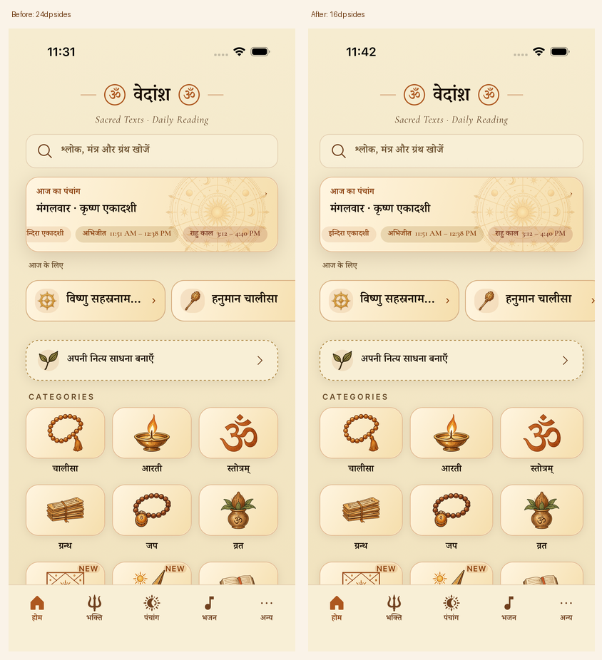
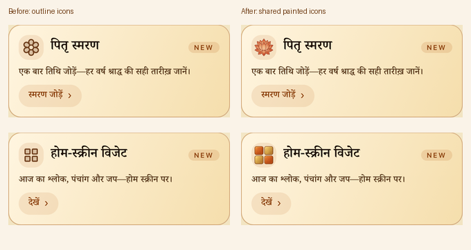
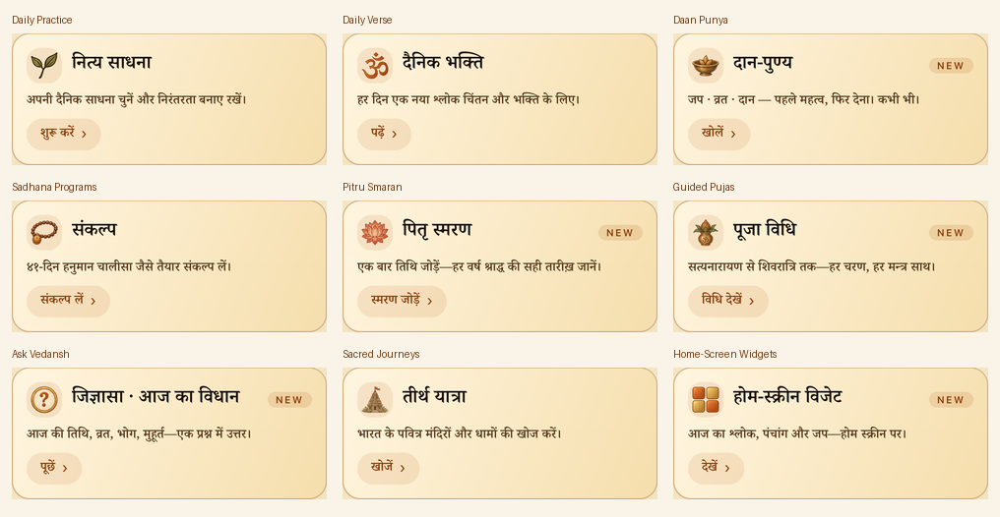

# Native Home gutter and Discover consistency — 6 October 2026

The approved native design had excessive 24dp Home side margins, and Discover still mixed old outline glyphs with painted subjects. This follow-up uses one **16dp Home gutter** and the same painted asset registries across all nine Discover cards.

## Installed result

These are actual native screenshots/crops, not a browser prototype. Source frames are 1206×2622px, representing 402×874pt at 3x on the iOS 26.5 QA simulator, version 1.4.9 (69). The Home before capture is the original `456be4e2` Release. The Discover before captures come from the intermediate padding-only build, before the icon substitutions. The final installed bundle and question-asset hashes are recorded in [size-comparison.json](size-comparison.json). [Capture metadata](capture-metadata.json) records source-file hashes; [crop metadata](crop-metadata.json) records original frames and rectangles. Native card crops retain 3x density; comparison sheets resample them to logical size and add labels outside the UI.

## Implementation

- `homeLayout.ts` supplies `spacing.lg` (16dp). Search, Today, Routine, the category grid, Daan and Kids Stories share that edge. Home passes the same gutter into FOR TODAY; both carousels cancel/re-pad it rather than carrying another 24dp inset. Total content width grows by 16dp. The 800dp cap, responsive columns, 10dp grid gaps, 62.7dp category art and filled NEW badge remain.
- `FeatureIcon.tsx` maps all nine Discover subjects to a centered 32dp transparent image inside the existing 36dp tile. Pitru Smaran, Widgets and Daan reuse `moreIconSources`; other subjects reuse `storybookSources`. No runtime tint or duplicate drawing is applied to a shared subject.
- Ask Vedansh uses one new painted question seal, generated by editing the existing information icon. The shipped PNG is 512×512, 41,602 bytes, with centered alpha bounds. Its exact prompt, reference/master hashes and packaging are in `assets/icons/more-storybook/question-prompt.json` and the asset manifest. The original master stays outside the shipped app.
- The painted Om is one `stotram.png` reused at different display sizes by Home categories, More's profile and Discover's Daily Verse. The circled Om in `HomeWordmark` remains a font glyph; its different appearance is a brand implementation exception, not another asset resolution.

## Verification

- Final complete `npm test`: **2,950 tests pass**, including typecheck, 37 widget tests, 228 UI suites / 2,109 UI tests, 589 engine tests, 166 data tests and 49 Ask tests. Existing system Node 25.9.0 was used. [Gate summary](tests-summary.log).
- Changed-source lint: **0 errors, 3 pre-existing test warnings**. `git diff --check` passes. [Lint output](lint.log).
- Combined Release build/install: **0 build errors/warnings**. The installed new PNG hash matches its manifest; bytecode differs from the controlled export by 38 bytes of build/export path metadata. [Build log](release-build.log).
- `home-gutter-smoke.yaml` passes native Search → Back, Kundali → Create Kundali, and Kids Stories → deity shelf → Back. It captures Home, the grid and the lower page. [Native log](home-smoke.log).
- `discover-icons-smoke.yaml` traverses the lower carousel and captures all nine painted subjects. Widgets opens its real gallery, Pitru opens the list with Add smaran, and Ask opens Today's Vidhan and its below-fold Ask something else control. Both cross-tab doors return to the More hub; Ask returns to Home. [Native log](discover-smoke.log).
- English at iOS `accessibility-medium` passes a separate capture flow: aligned page edges, two-column grid, contained art/NEW badges and the visible Discover card. Hindi and the system `large` setting are restored afterward. [Enlarged captures](enlarged-preview.png), [flow](capture-enlarged.yaml), [log](enlarged-smoke.log).

Earlier capture attempts used horizontal swipes outside the intended band or waited for the below-fold Ask CTA without scrolling. Those failed attempts are not counted as passes. The final flow swipes within the actual carousel band and scrolls to that CTA. Some swipes did not advance immediately; the 14-frame walk supplied a complete nine-subject gallery. The existing one-line Discover descriptions and Kids Stories deity summary ellipsize at enlarged text. Other enlarged Discover subjects, Android, physical devices, full screen-reader traversal and a new tablet/rotation matrix were not verified in this follow-up; prior branch evidence stays separate.

## Bundled size

The follow-up adds **43,453 bytes ≈ 43KB** over `456be4e2`: one 41,602-byte question PNG plus 1,851 net Hermes bytes. The other eight Discover subjects reuse already-shipped art. The 56 painted icon PNGs total **2,157,931 bytes**; including the two existing chakra PNGs gives **2,432,323 bytes**.

The complete PR's controlled production iOS export increases bundled assets plus bytecode by **2,615,500 bytes ≈ 2.62MB** over `cb38ba61`, now 58 additional assets. This is bundled content, not the compressed App Store/IPA/APK download delta. [Raw measurement and hashes](size-comparison.json). No merge, OTA or store publication was performed.
