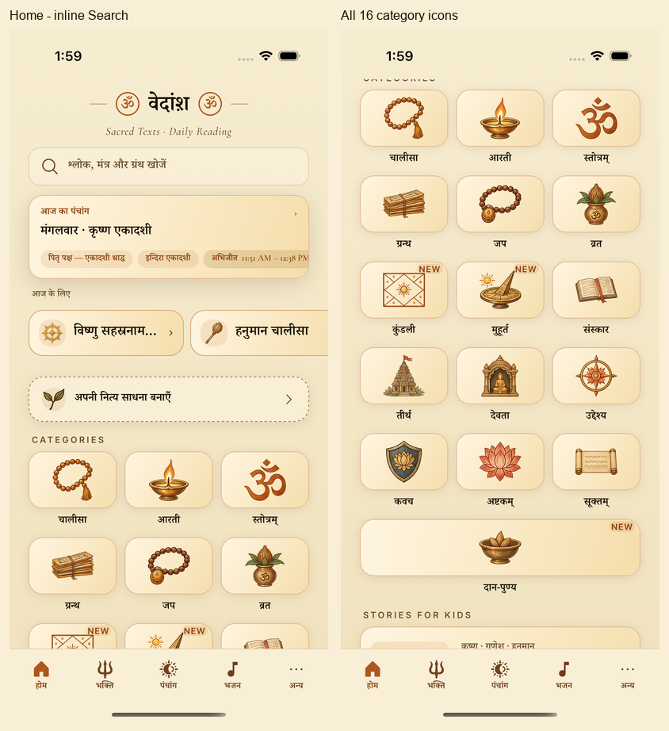

# Native sizing recommendations: implemented

The category artwork remains **62.7dp** (about 53dp visible), exactly the approved 5% reduction. Default phone tiles remain **72dp** high. The filled NEW cue and painted pigments are preserved. This follow-up changes the enclosing layout and controls, rather than enlarging or shrinking the artwork again.

## What changed

| Review finding | Implemented behavior |
| --- | --- |
| Enlarged NEW overlaps Kundali/Muhurat | Every Home tile grows uniformly above system fontScale 1.2, clearing the filled badge row while retaining one art center. Captions can use two lines. NEW is 11pt with a 13pt line box, still inside at top 2dp/right 6dp. |
| iPad rotation retains old widths | `useWindowDimensions()` and safe-area width feed `homeLayout.ts`. Centered Home content is capped at 800dp. Normal text uses three phone/five tablet columns (tablet threshold 640dp); enlarged text uses two/three. Daan uses the actual full grid width. |
| Reader hitSlop depends on parent bounds | Bookmark/share have real 48×48dp Pressables around their original 34dp circles; Back has a 48dp target around its original 44dp circle. The verse pill is centered against the larger action row. |
| Small/low-contrast tab labels | Labels start at 11pt and grow up to 1.4x. Captions use the full tab width; English tracking drops at enlarged text. Active labels use `saffronDeep`, 6.60:1 over `parchmentSoft`; selected icon pigment stays `iconAccent`. Full localized tab titles remain available to accessibility. |
| Search covers category art | A minimum-48dp inline Search row sits below the wordmark, uses Home's first-tap/drag handling, and opens the existing route with the existing accessible label. |
| Fixed large-text chrome | Decorative Om/wordmark proportions remain fixed; the tagline scales. Enlarged FOR TODAY cards widen and wrap full titles. Today headlines/chips and inline Routine titles reflow rather than truncate. |

## Visual evidence

- [Default-size before/after](default-grid-before-after.png): all sixteen subjects stay centered and retain their approved size and pigments. The Home scroll offsets differ slightly; the category content is the same.
- [Enlarged Hindi before/after](large-text-before-after.png) and [badge detail](badge-clearance-detail.png): same 375×667pt device, light theme, accessibility-medium setting. The grid intentionally reflows from three to two columns, so the same features require different scroll offsets. The focused crops use actual tile rectangles at the same 2x density.
- [Enlarged English recommendations](compact-enlarged-english-recommendations.png) and [NEW/tab state](compact-enlarged-english-new.png): full recommendation title, Today headline, Routine prompt, Panchang/Bhajan tab names and badge clearance.
- [iPad landscape before/after](tablet-before-after.png): five defined tracks replace accidental four-column wrapping; centered content and the full-width Daan row fill the current grid. [Portrait return](tablet-portrait-return.png) checks that rotation back recalculates again.
- [Reader and More](reader-and-more.png): preserved glyph/circle scale, centered reader actions and shared utility tint.

Exact native PNGs are retained beside these presentation sheets. Sheets only apply EXIF orientation, resize to logical-point scale, crop comparison regions and add labels outside app pixels; they do not repaint UI. Captures use Release `com.prashantsharma.vedansh`, version 1.4.9 (69), iOS 26.5. Default phone captures are Hindi; compact enlarged captures cover Hindi and English. Landscape PNGs carry EXIF orientation 8; the displayed viewport is 1133×744pt despite portrait-oriented stored pixels. [Capture metadata](capture-metadata.json) records both dimensions.

## Validation

- Full local checks: **2,941 tests** — widgets 37, UI 2,100 across 226 suites, engine 589, data 166, Ask 49. The last changes only name the label renderer and give captions their full tab width; final typecheck, changed-source lint and native verification cover those changes.
- Observance verification: zero failures, known divergences or anchor/rule-table drift.
- Final Release build: zero errors/warnings, installed and tested without Metro.
- Native smoke: Home → Chalisa → Hanuman reader/bookmark add-remove → More → By Deity → current Home kids-story shelves → Panchang → Bhajan → Search → reader/Home. The Search step scrolls to its new inline position.
- Phone rendering: 375×667pt compact, 402×874pt QA phone, and 440×956pt large phone. Artwork retains square proportions; scrolling accommodates short screens.
- iPad: 744×1133pt portrait → 1133×744pt landscape → portrait. Geometry and full-width Daan update in both directions.
- Temporary sizing simulators are removed after capture; the original QA simulator remains installed.

Reproducible flows are in [capture-flows](capture-flows/). Use `maestro --device <UDID> test <flow> --test-output-dir <dir>`; explicit screenshots are saved under `<dir>/screenshots/` using the path in the flow and then copied here unchanged. Use `--no-reinstall-driver` only after installing the Maestro driver on that device. Enlarged text requires `xcrun simctl ui <UDID> content_size accessibility-medium`; normal text uses `large`. The final English-only flow assumes the preceding enlarged flow selected English.

Earlier attempts are not acceptance evidence: the first grid framing cut the Daan row and was replaced; the first iPad flow stopped on the feature-tour overlay because the tour appeared after Begin. A second Skip check and rerun resolved onboarding. Enlarged English initially still shortened tab names and a long recommendation; natural title wrapping and full-width captions were recaptured and inspected.

Android, physical-device ergonomics, complete VoiceOver/TalkBack navigation, Gujarati/Kannada widths and the largest Dynamic Type setting remain unverified. No merge, OTA or store publication occurred.
