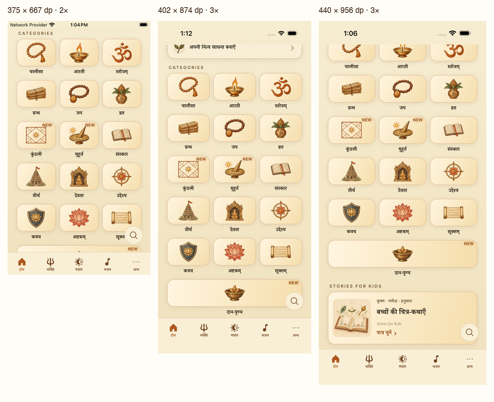
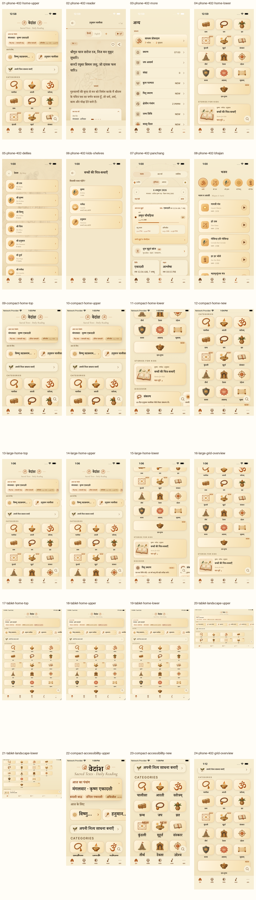

# Native icon sizing and screen review

**Verdict: keep the current category illustration size.** The 62.7dp image canvas (about 53dp of visible artwork) looks balanced within the original 72dp tiles on all three tested phones. It is exactly 5% below the previous 66dp canvas. The full tile and caption are interactive; the painted subject is not the touch target. Normal-size icons remain centered, sharp and unstretched. Broader usability gaps remain at enlarged text and tablet rotation.

This review uses fresh installed iOS Release captures from the merged branch `b8862fea`, version 1.4.9 (69). It reviews the app, not the browser prototype. The supplied attachment path was missing, so the current simulator build was captured directly. No product sizing or accessibility fixes were applied during this review.

## Phone measurements

Home calculates tile width as `(screen width − 2×24dp gutter − 2×10dp gap) / 3`. Short screens scroll vertically; they do not squeeze or stretch the artwork to fit every category into one viewport.

| Device | Logical screen | Raw pixels | Height/width | Tile width | Normal-size result |
| --- | --- | --- | --- | --- | --- |
| iPhone SE 3 audit simulator | 375×667pt | 750×1334, 2× | 1.779 (16:9) | 102.33dp | Balanced artwork; NEW pills inside and clear |
| Existing QA iPhone | 402×874pt | 1206×2622, 3× | 2.174 | 111.33dp | All 16 subjects visible together in capture 24 |
| iPhone 17 Pro Max audit simulator | 440×956pt | 1320×2868, 3× | 2.173 | 124dp | Same readable artwork scale; more vertical space |

The square 512px PNGs render with `resizeMode="contain"`; 62.7dp at 3× needs about 188px, comfortably below the supplied resolution. Screen aspect ratio affects the visible number of rows, not an illustration's own proportions. These measurements support this design choice; they are not a platform-mandated illustration size.

## Standards and touch targets

[Apple's UI design guidance](https://developer.apple.com/design/tips/) recommends at least 44×44pt touch targets, text of at least 11pt, high-resolution imagery and preserved image proportions. [Android's accessibility guidance](https://developer.android.com/guide/topics/ui/accessibility/apps) recommends at least 48×48dp targets and 4.5:1 contrast for small text. Neither source requires an illustrated category subject to be the same size as a utility glyph.

| Control | Evidence | Assessment |
| --- | --- | --- |
| Home categories | 72dp tile height plus caption, at least 102.33dp wide on tested phones | Generous enclosing target; retain current art size |
| Search | 24dp glyph within a 48×48dp Pressable | Numeric target meets both benchmarks; overlay placement remains a concern |
| Bottom tabs | Native hierarchy: approximately 80×53pt per tab on the 402pt phone | Target dimensions sufficient; labels have size/contrast issues |
| Reader Back | 22dp glyph, 44×44dp control in code | Meets Apple's numeric minimum; a real 48dp wrapper would also meet Android's |
| Reader bookmark/share | 21/20dp glyphs, 34dp circles, `hitSlop={12}`, closely sized parent row | Do not assume nominal 58dp hitSlop means a 58dp effective target; use real 48dp wrappers |
| More and deity cards | Compact symbols within large enclosing rows | Clear normal-size rendering and generous row targets |

[React Native documents that hitSlop cannot extend past parent bounds](https://reactnative.dev/docs/pressable). The reader's 34dp circles and enclosing action row are therefore a touch-target risk that screenshots and source-level arithmetic cannot certify away. The glyphs themselves are appropriately sized; increasing their stroke artwork is unnecessary.

## Findings and recommended changes

1. **[P2] Give enlarged NEW states a reserved area.** At iOS `accessibility-medium`, the pill overlaps the Kundali frame and Muhurat pointer (capture 23). Keep the filled treatment and centered illustration, but move the status to a separate caption/status line or reserve space in a larger-text layout.
2. **[P2] Make tablet layout react to rotation.** Portrait has three 225.33dp-wide tiles with considerable empty padding. Landscape wraps four portrait-sized tiles, leaves a large empty right side, and keeps Daan at its old approximately 696dp span (captures 20–21). `HomeScreen` reads `Dimensions.get('window').width` without subscribing to changes. Use `useWindowDimensions()` together with a defined tablet column/content-width policy and a full-width span derived from that grid. Enlarging the artwork would not fix this.
3. **[P2] Give reader actions real minimum targets.** Retain the 34dp visible circles and 20/21dp glyphs inside 48×48dp Pressable wrappers, rather than relying on parent-limited hitSlop (capture 02 and source).
4. **[P3] Improve small status and tab text.** NEW and tab labels are 10pt, below Apple's 11pt guidance. Active-tab accent `#AD571F` on `#F8EFD6` calculates to 4.40:1, slightly below the small-text 4.5:1 benchmark. A darker label token can preserve the icon accent. Ordinary utility ink is 7.61:1; NEW text over its filled gradient background ranges from 4.84:1 to 5.76:1.
5. **[P3] Keep Search clear of category artwork.** The floating 48dp button covers parts of Sanskar, Vrat or Purpose at different scroll positions (captures 01, 09, 13 and 23). The controls remain reachable by scrolling; a placement change should prevent this visual competition.
6. **[P3] Review other fixed chrome at enlarged text.** Text-based Om brand marks crowd their circle boxes, recommendation titles heavily ellipsize, and tabs remain small (capture 22). These need a broader typography pass; shrinking category illustrations would not resolve them.

## Numbered capture walkthrough

Each linked file is an exact accepted native capture. Repeated top/upper states are retained and identified; they are not presented as new scroll positions. Detailed strengths, risks, limitations and rejected attempts are in [the capture notes](notes.md).

| Step | Screen | Health |
| --- | --- | --- |
| [01](01-phone-402-home-upper.png) | 402pt Home, upper rows | Artwork good; small labels/Search overlap |
| [02](02-phone-402-reader.png) | Hanuman reader and action controls | Visuals good; touch-target risk |
| [03](03-phone-402-more.png) | More utility rows | Good normal-size alignment |
| [04](04-phone-402-home-lower.png) | Lower categories, Daan, current Kids Stories door | Good normal-size alignment |
| [05](05-phone-402-deities.png) | By Deity compact attributes | Good normal-size alignment |
| [06](06-phone-402-kids-shelves.png) | Current Krishna/Ganesha/Hanuman shelves | Good normal-size alignment |
| [07](07-phone-402-panchang.png) | Panchang controls and active tab | Good visible icon rendering |
| [08](08-phone-402-bhajan.png) | Bhajan filters and thumbnails | Good visible icon rendering |
| [09](09-compact-home-top.png) | 375pt Home first viewport | Balanced art; Search overlap |
| [10](10-compact-home-upper.png) | Compact upper rows, same pixels as 09 | Same accepted state |
| [11](11-compact-home-lower.png) | Compact lower categories and Kids Stories | Good normal-size layout |
| [12](12-compact-home-new.png) | Compact Kundali/Muhurat middle row | Filled NEW inside; clear at normal size |
| [13](13-large-home-top.png) | 440pt Home first viewport | Balanced art; Search overlap |
| [14](14-large-home-upper.png) | Large upper rows, same pixels as 13 | Same accepted state |
| [15](15-large-home-lower.png) | Large lower grid and Kids Stories | Good normal-size layout |
| [16](16-large-grid-overview.png) | Large scrolled category overview | Good; first row partly above viewport |
| [17](17-tablet-home-top.png) | 744pt iPad portrait | Readable art; excess empty tile width |
| [18](18-tablet-home-upper.png) | Tablet upper rows, same pixels as 17 | Same accepted state |
| [19](19-tablet-home-lower.png) | Tablet Daan already visible, same pixels as 17 | Same accepted state |
| [20](20-tablet-landscape-upper.png) | 1133pt iPad landscape, upper rows | Rotation layout needs improvement |
| [21](21-tablet-landscape-lower.png) | iPad landscape lower rows and Daan | Daan span and unused right space need improvement |
| [22](22-compact-accessibility-upper.png) | Compact accessibility-medium, upper Home | Brand marks/title layouts need improvement |
| [23](23-compact-accessibility-new.png) | Compact accessibility-medium, NEW row | Pills overlap artwork |
| [24](24-phone-402-grid-overview.png) | Fresh merged-main all-16 category grid | Approved default-size treatment verified |

## Evidence limits and validation

- Full merged-branch checks passed: typecheck plus 2,928 tests; observance verification had zero failures/divergences/drift; iOS Release build had zero errors and warnings.
- Updated native routing passed through Home, Chalisa, reader/bookmark add-remove, More, By Deity, the current Home kids-story shelves, Panchang, Bhajan and Search back to the reader/Home. Focused device/grid capture flows passed.
- An initial redundant Hanuman centering step failed despite the row being visible; it was removed. The first tablet attempt exited to Springboard with a SIGABRT in Expo file logging while host free disk was only 244MiB. After relaunch and removing completed temporary devices, the full tablet portrait/landscape capture retry passed. This review did not repair or establish the ultimate cause of that logging crash.
- Captures are Hindi, light theme. The 21-deity asset mapping is tested, but every deity/control on every route was not rendered in this sizing audit. Other language widths, dark theme, Android, physical-device ergonomics, complete VoiceOver/TalkBack navigation and the largest Dynamic Type settings remain unverified.
- Landscape PNGs retain their original EXIF orientation; [capture metadata](capture-metadata.json) records stored and displayed dimensions. Presentation sheets apply orientation and rescale the screenshots with annotations outside the app pixels. No replacement artwork is painted into them.
- [Capture flows](capture-flows/) are provided for reproducibility from the repository root. The enlarged-text flow requires setting the temporary simulator with `xcrun simctl ui <UDID> content_size accessibility-medium` first. Temporary audit devices were removed; the original QA simulator remains on the full category grid.

The icon refresh is ready for review at the accepted default scale. This is not an all-platform or accessibility-compliance pass, and the findings above are not claimed as fixed.
